# IngestionTimeSeriesData

[toc]

## Project Overview

This repository houses the ingestion framework for a hypothetical organization's time-series sensor data.  It includes
configuration-driven pipelines (Databricks jobs) that pull CSV files from Azure Data Lake Storage,
apply governance and schema validation, evolve schemas automatically, and write out raw/bronze tables
in a Unity Catalog-enabled Databricks environment.  Source configurations, quality rules, and metadata
are all declared in `configs/sources/*` JSON files, allowing new sensor types to be onboarded with
minimal code changes.

### Features

* Reusable schema definitions with per-source metadata
* Sensor-specific quality and standardization rules
* Timestamp parsing, **freshness monitoring**, and schema evolution via Databricks Autoloader
* Governance tags for layer/entity/measurement with retention settings
* Support for quarantining invalid or unexpected records (see example below)

## Data validation and freshness tests

The ingestion framework incorporates extensive data quality controls and monitoring.  Quality checks are enforced at every step to ensure only valid records reach analytics consumers, and freshness tests alert if expected files are missing or delayed.

### Quarantined Records Example

Below is a sample of what a quarantined record may look like when the ingestion job detects
schema violations or quality failures. Records are written to a separate Delta table and can be
reviewed or corrected manually.

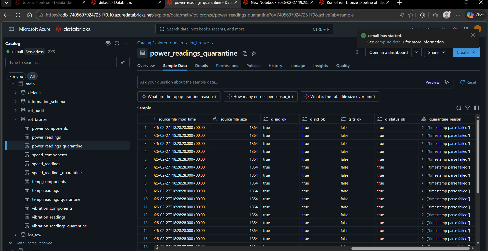

### Real-World Case Study: Timestamp Parsing Quarantine

During development, an intentional/realistic data quality issue was observed that demonstrated the value of the quarantine pattern.

**What happened:**

The Bronze pipeline originally attempted to parse timestamps using a single expected format (`dd/MM/yyyy HH:mm`). However, the raw ingestion step produced timestamps in an ISO-like format (`yyyy-MM-dd HH:mm:ss`) and in some cases the column was already stored as a proper timestamp type. As a result, the Bronze parsing step returned NULL timestamps for valid records.

**Impact:**

The timestamp quality check (`timestamp IS NOT NULL`) failed for a large proportion of records, and the pipeline correctly routed them to quarantine with a failure reason similar to:

```
"timestamp parse failed"
```

**Why this is valuable:**

This shows that the pipeline does not silently discard or incorrectly promote bad/invalid data. Instead, it isolates records for investigation, provides diagnostics, and prevents downstream analytical datasets from being polluted.

**Fix applied:**

The Bronze pipeline parsing logic was updated to be robust to multiple formats and to handle already-typed timestamp columns safely (e.g., using `coalesce(timestamp.cast("timestamp"), to_timestamp(...))`). After this fix, valid records were promoted to Bronze correctly and only truly invalid records remained quarantined.

This development issue is included as evidence of how the quarantine mechanism behaves under real-world schema/format drift scenarios (a common issue with IoT and operational telemetry feeds).

## Governance strategy

Governance is handled through Unity Catalog integration and metadata declared in the JSON configs.  A dedicated job task applies table/column tags after Bronze materialisation, ensuring classification, sensitivity, domain and measurement type are consistent across layers.  Access control is managed via external locations and catalog permissions (see References below).

## Schema evolution or sensor hardware changes

This project is designed to handle real-world upstream changes (e.g., sensor firmware updates, new telemetry fields, format changes) without breaking ingestion or silently corrupting downstream datasets.

### Raw Layer (iot_raw.*_raw) — "Capture Everything, Tolerate Drift"

The Raw layer is ingested using Databricks Auto Loader and is intentionally tolerant to schema changes. The goal is to preserve an immutable "as-received" record of upstream data.

**Behaviour:**

* Additive schema changes are allowed (e.g., new columns appearing in CSVs).
* Raw tables store ingestion metadata such as:
  * `_ingest_ts` (ingestion timestamp)
  * `_ingest_date` (source folder date, e.g. YYYYMMDD)
  * `_source_file` (path from `_metadata.file_path`)
* Unexpected fields can be captured via a rescued data column (e.g., `_rescued_data`) to prevent ingestion failure and preserve the raw payload for investigation.

**Why this matters:**

IoT telemetry formats can drift over time. The Raw layer ensures I never lose information, even if the source changes unexpectedly.

### Bronze Layer (iot_bronze.*) — "Governed Contract + Quarantine"

The Bronze layer is implemented using Delta Live Tables (DLT). Bronze is where I introduce "production-grade" standardisation and data quality controls, while still remaining close to source.

**Behaviour:**

Bronze enforces a stable, intentional schema contract:

* timestamps and dates are normalised into proper types
* numeric fields are cast to the expected type (double)
* UNS hierarchy fields are derived from Path to provide consistent join keys
* temperature readings are standardised into Celsius (`degrees_c`) to prevent mixed-unit analysis issues

Bronze applies quality checks and routes invalid records into paired quarantine tables:

* `<dataset>` = valid records only
* `<dataset>_quarantine` = failed records + diagnostic fields (`_q_*`, `_quarantine_reason`)

**How schema drift is handled in Bronze:**

If upstream introduces new columns:

* Raw captures them automatically.
* Bronze continues to promote canonical fields safely.
* New fields are only promoted intentionally after updating the pipeline/config and applying governance tags.

If upstream introduces format/type changes (e.g., timestamp format changes):

* Bronze parsing is designed to be robust (supports both dd/MM formats and ISO-like formats, and handles already-typed timestamp columns).
* Rows that still cannot be parsed are quarantined with a clear reason such as `timestamp parse failed`.

If upstream introduces breaking changes (e.g., required column removed):

* Bronze expectations / validation logic prevents invalid data from being promoted, either quarantining affected rows or failing the run depending on the severity of the change.

**Why this matters:**

Bronze acts as the "trust boundary" of the platform: schema changes do not automatically propagate to analytics consumers, and invalid data is isolated and explainable.

### Operational Replay / Backfill Note

Because Raw ingestion and Bronze transformation are incremental/streaming by design, controlled replay can be performed when needed (e.g., to reprocess a specific `ingest_date` after a fix):

1. Remove data for the relevant `_ingest_date` from raw/bronze
2. Rerun ingestion with a new Auto Loader checkpoint location (treating files as "new")
3. Run the Bronze pipeline with a full refresh/reset to recompute outputs cleanly
> **Tip:** the `run_bronze_pipeline` task in `resources/jobs.yml` accepts a `full_refresh` boolean parameter. Setting `full_refresh: true` will force DLT to discard any existing state and rebuild all Bronze tables from the current raw data, which is useful for full backfills or when schema/config changes require a clean slate.
This provides a realistic "production" approach to backfills and reprocessing without manual file manipulation.


### Silver Layer Build (Conformed Model)

The Silver layer (`main.iot_silver`) produces a conformed, analytics‑ready model from Bronze. Silver focuses on conformance, joinability, and long‑term schema evolution for IoT telemetry while keeping Bronze as the platform's trust boundary.

Silver produces two core outputs:

1. `iot_silver.dim_component` (Conformed Component Dimension)**

- Purpose: one authoritative record per physical component (grain: 1 row per `Path`).
- `component_key` is computed (e.g., `sha2(Path,256)`) to provide a stable join key.
- Consolidates sensor identifiers across measurement domains (`sensor_id_power`, `sensor_id_speed`, `sensor_id_temp`, `sensor_id_vibration`).
- Stores installation dates per sensor type when available (`installation_date_power`, etc.).
- Derives the UNS hierarchy (enterprise/site/area/machine/component) deterministically from `Path` to avoid ambiguity when multiple Bronze component tables contain UNS fields.

2. `iot_silver.fact_measurement_long` (Unified Long‑Format Measurements Fact)**

- Purpose: store all measurements in a single time‑series fact table that supports schema growth.
- Rationale: IoT datasets evolve (new metrics, sensor replacement); long format avoids frequent wide‑table schema changes.
- Core schema (conceptual): `event_ts`, `component_key`, `sensor_id`, `measurement` (string), `value_double` (double), `value_string` (string), `unit` (string), lineage metadata (`_ingest_date`, `_source_file`).
- Numeric measures populate `value_double` (leave `value_string` null); categorical measures populate `value_string` (leave `value_double` null).

**Note on `value_double` vs `value_string`:**
This table supports both numeric and categorical measures:

- Numeric measurements populate `value_double` and leave `value_string` null (e.g., speed, temperature, vibration).
- Categorical measurements populate `value_string` and leave `value_double` null (e.g., power state `ON`/`OFF`).

This behaviour is intentional and simplifies downstream logic without forcing all measures into a string representation.

**Streaming vs materialised processing**

- `dim_component` is computed with batch reads (`spark.read.table(...)`) — small, slowly changing, cheap to recompute.
- `fact_measurement_long` is built via streaming reads (`spark.readStream.table(...)`) — high volume, append‑heavy; streaming enables incremental processing and efficient stream‑to‑static joins against `dim_component`.

**Type & unit standardisation**

- Temperature: uses canonical `degrees_c` from Bronze.
- Units are assigned explicitly (e.g., speed → `Hz`, temperature → `C`).
- Vibration sources lack explicit units; Silver assigns engineering units by measurement type for downstream completeness:
  - `vibration_acceleration` → `m/s^2`
  - `vibration_velocity` → `mm/s`
  - `vibration_peak_to_peak` → `mm`

**Common data quality observation (schema/format drift)**

- An early iteration showed timestamps in mixed formats (ISO and `dd/MM/yyyy HH:mm`) and already‑typed timestamp columns. Bronze initially returned NULLs and quarantined rows with `"timestamp parse failed"`.
- Parsing was hardened (e.g., `coalesce(timestamp.cast("timestamp"), to_timestamp(...))`), demonstrating the quarantine pattern and pipeline hardening process.

**How Silver enables Gold analytics**

- `dim_component` provides stable join keys and UNS hierarchy for slicing by machine/component.
- `fact_measurement_long` is a single unified stream that can be time‑bucketed, pivoted, correlated, and used to compute rolling baselines, anomaly scores, and maintenance risk rankings.

The images below show a complete successful Silver pipeline run (job summary, pipeline YAML view, and lineage/metrics):

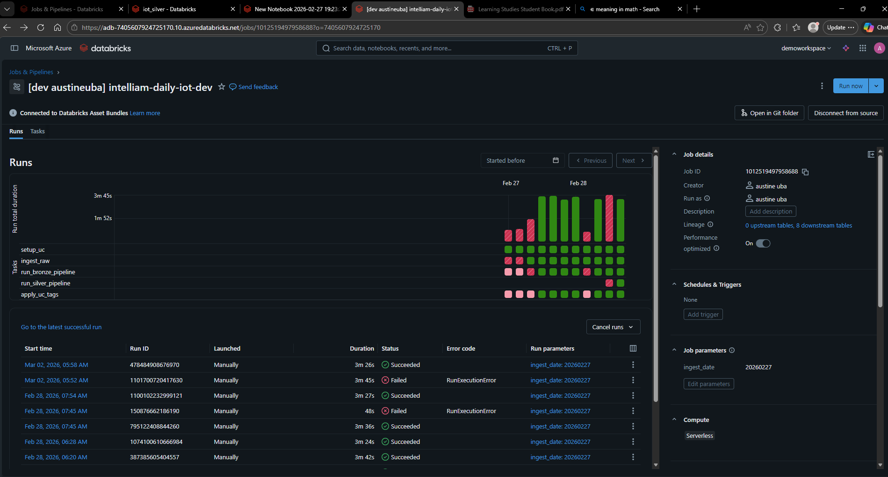

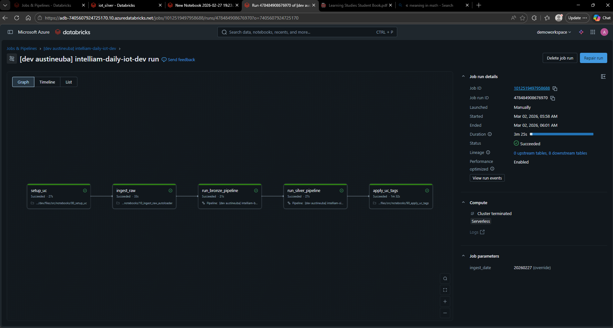

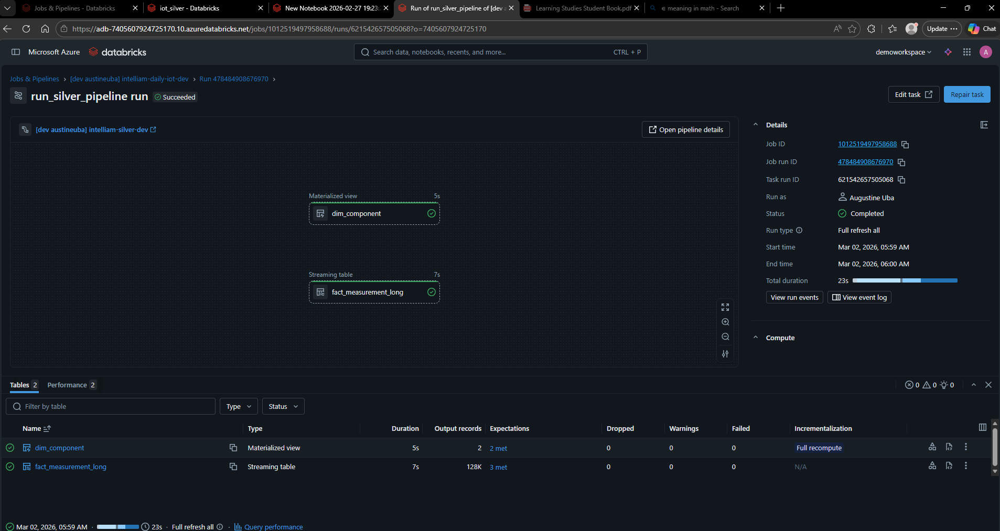

### Gold Layer Build (Correlated Analytics + Findings)

The Gold layer (`main.iot_gold`) is the business-facing output of the pipeline. It takes the conformed Silver model (`iot_silver.dim_component` + `iot_silver.fact_measurement_long`) and produces:

* a time-aligned correlated dataset (speed, temperature, vibration aligned by component + time bucket)
* anomaly flags derived from baseline behaviour per component
* maintenance recommendations that can be consumed directly by stakeholders

Gold is built using a dedicated DLT/Lakeflow pipeline.

**Gold Tables and Meanings**

1. `iot_gold.component_health_1m`
   * What it is: The core correlated dataset, aggregated to 1-minute buckets per component.
   * Why it exists: Correlation/anomaly work requires aligned time series. Different sensors produce readings at different rates; Gold aligns them into a common time grain.
   * Grain: `(component_key, time_bucket)`
   * Outputs (key columns):
     * `time_bucket` (minute start timestamp)
     * `component_key`, `Path`, `uns_machine`, `uns_component`, etc.
     * Correlated measures: `avg_speed_hz`, `avg_temp_c`, `avg_vibration_velocity`, `avg_vibration_acceleration`, `avg_vibration_peak_to_peak`, `power_on_ratio` (0–1 within the minute; optional operational context)
   * Expected usage: plot speed vs temperature vs vibration over time per component; compute correlations per component; feed anomaly detection logic.

2. `iot_gold.component_stats`
   * What it is: A helper table that computes baseline statistics per component from `component_health_1m`.
   * Why it exists: Anomaly detection requires “normal behaviour” per component.
   * Grain: `(component_key)`
   * Outputs (examples): `mean_temp_c`, `std_temp_c`, `mean_vibration_velocity`, `std_vibration_velocity` (and similar for speed).
   * Expected usage: baseline for z-score style detection; simple component benchmarking.

3. `iot_gold.component_anomalies`
   * What it is: A filtered subset of `component_health_1m` where a component shows unusual behaviour vs its own baseline.
   * How it works (current approach): z-score rule: flag if temperature OR vibration velocity exceeds a configurable threshold relative to that component’s mean. The default conservative threshold is 3 standard deviations (3σ).
   * Grain: `(component_key, time_bucket)` for anomalous buckets only.
   * Outputs (examples): the correlated measures (from `component_health_1m`), `z_temp`, `z_vibration_velocity`, `anomaly_flag` (true), `anomaly_reason` (array), e.g.: `TEMP_SPIKE_VS_BASELINE`, `VIBRATION_SPIKE_VS_BASELINE`.
   * Expected usage: “Where and when did behaviour deviate?”; evidence for maintenance actions.

   **Anomaly Threshold Tuning Note**

   The Gold anomaly detection uses a simple per-component baseline approach (z-score) to flag unusual behaviour in temperature and vibration velocity relative to each component’s historical mean and standard deviation.

   In the initial implementation, a conservative threshold was used (commonly z > 3σ) to minimise false positives. On the provided dataset/time window, this resulted in no anomalies detected, which is a valid outcome (i.e., the data appears stable under that strict definition).

   For the purpose of this practical, I also tested less conservative thresholds to demonstrate the end-to-end workflow and business outputs:

   * At z > 2σ, the anomaly table still returned 0 rows for this dataset.
   * I then reduced the vibration threshold to z > 1σ (while keeping temperature at the stricter threshold) to increase sensitivity and validate the downstream pipeline behaviour.

   After tuning:

   * `iot_gold.component_anomalies` produced 597 anomalous time buckets
   * `iot_gold.maintenance_recommendations` produced 2 component-level recommendations (one per component in the dataset)

   (see example anomaly table below when z > 1 for vibration)

   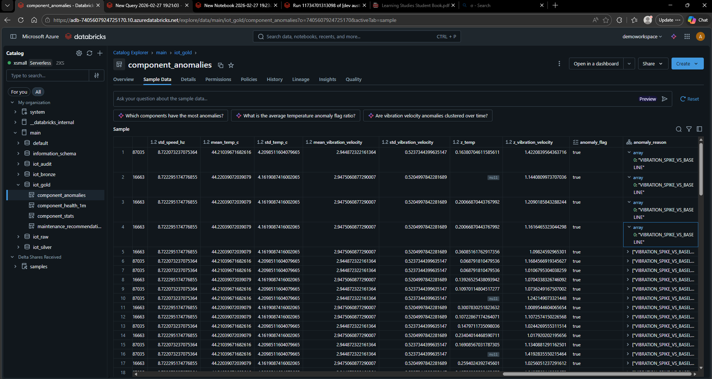

   * The pipeline does not manufacture findings at conservative thresholds.
   * The anomaly outputs are configurable and can be tuned in production based on domain tolerance for false positives vs missed faults, and ideally calibrated using historical failure/maintenance labels.

4. `iot_gold.maintenance_recommendations`
   * What it is: A business-friendly summary table per component that aggregates anomalies and produces a recommended action.
   * Why it exists: Stakeholders typically want an actionable view, not raw anomaly rows.
   * Grain: `(component_key)`
   * Outputs (examples): `anomaly_count`, `latest_anomaly_time`, `anomaly_reasons` (distinct reasons seen), `recommendation` (human-readable).
   * Expected usage: operational reporting (“which components should I inspect next?”); maintenance planning / prioritisation.

The images below demonstrate a successful Gold pipeline execution including job summary and final output validation.

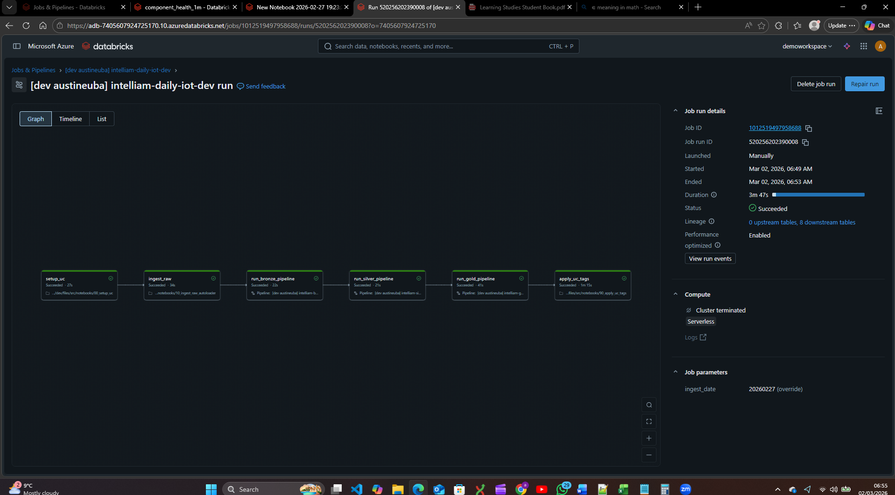

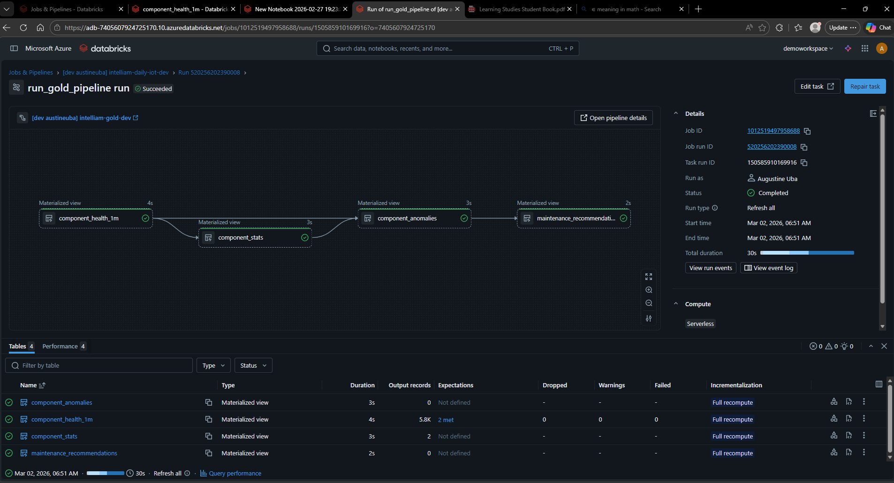

## Pipeline Runs & Monitoring

### Job Pipeline Summary

The Databricks Jobs pipeline orchestrates the daily ingestion workflows. The following shows the
overall job run summary page, displaying job execution status, duration, and task dependencies.

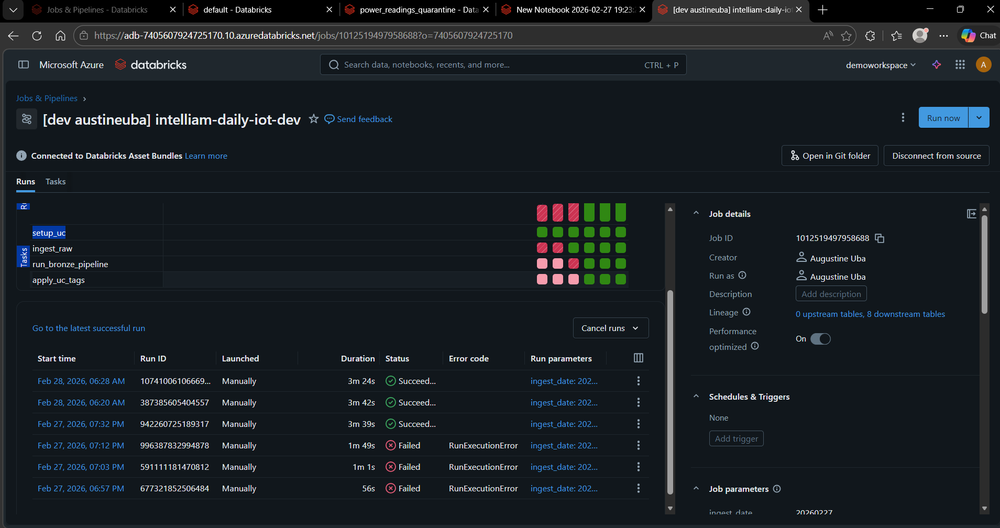

### Pipeline YAML Run View

This view shows the pipeline.yml execution details within Databricks, including logs and task-level
execution info for the ingestion workflows.

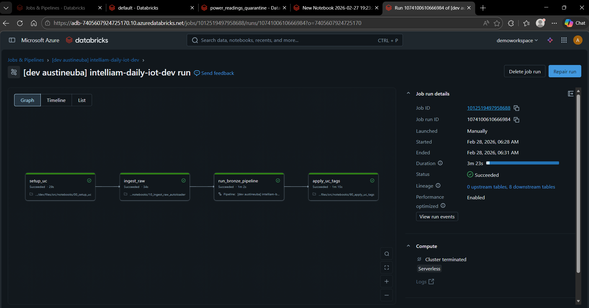

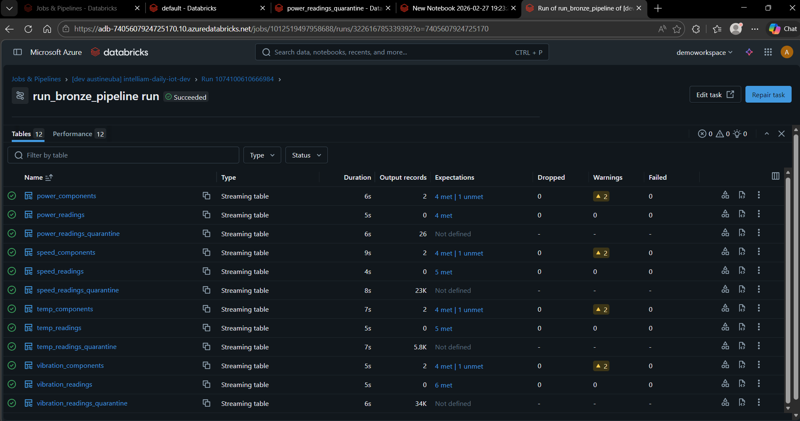

### Bronze Pipeline Data Quality Summary (DLT)

The Delta Live Tables (DLT) run provides comprehensive data quality monitoring and expectations validation.
This view displays:

**Expectations (Data Quality Rules)**

Each Bronze table has DLT expectations to monitor key quality checks such as required fields being present (e.g., UID, sensor_id, timestamp, Path), valid enumerations (e.g., power status {ON,OFF}), and numeric validity/range checks (e.g., speed hertz, temperature degrees, vibration metrics). Expectations also publish pass/fail metrics in the DLT event log and UI.

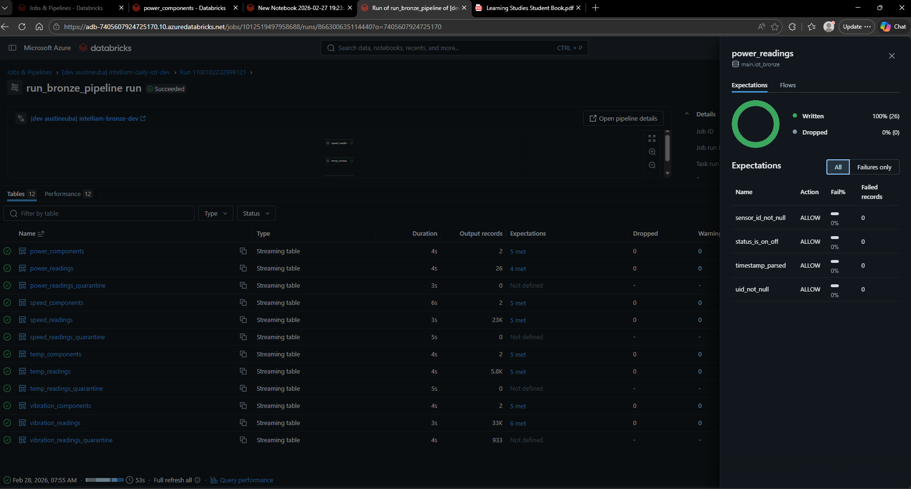


**Quarantine Handling (Bad Data Isolation)**

For each readings dataset I generate two outputs:

* `<dataset>`: valid records only
* `<dataset>_quarantine`: invalid records isolated for inspection

Quarantined records carry diagnostic fields:

* `_q_*` boolean flags indicating which checks passed/failed
* `_quarantine_reason` (array of human-readable failure reasons)

This ensures bad data is not silently dropped and can be traced back and remediated.

**Standardisation and Type Enforcement**

Bronze enforces consistent types and formats:

* `timestamp` and `installation_date` are normalised (robust parsing supports both dd/MM formats and ISO timestamps from raw)
* numeric fields are cast to double for downstream analytics
* temperature is standardised to Celsius (`degrees_c`) to avoid mixed-unit analysis issues

**Lineage and Operational Visibility**

DLT automatically captures lineage between the raw Delta sources (e.g., `iot_raw.<dataset>_raw`) and bronze outputs (e.g., `iot_bronze.<dataset>`), and provides operational metrics such as processed row counts and expectation pass/fail rates per run.

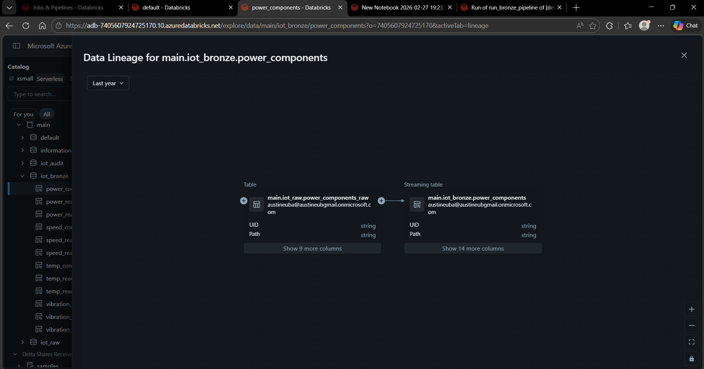

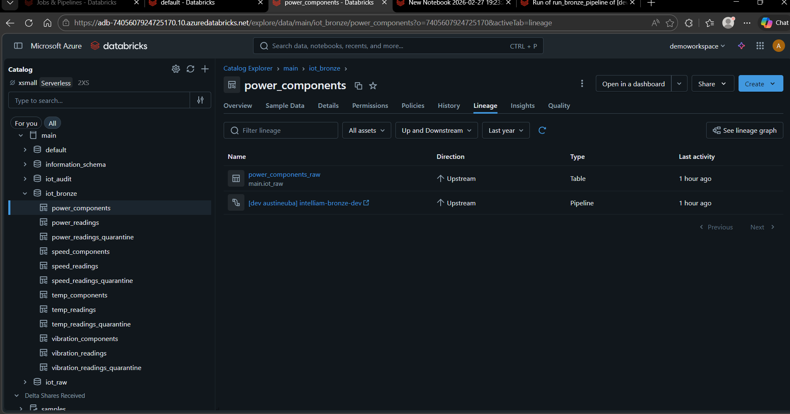

**Metadata and Governance Integration (Post-Step)**

After DLT materialises the Bronze tables, a separate job task applies Unity Catalog table and column tags from the JSON configs. This keeps governance concerns (classification, sensitivity, domain, measurement type, etc.) consistent across raw and bronze without complicating the pipeline runtime.

## Executive Summary of Insights

Using the Gold analytics layer (`iot_gold.component_health_1m` and `iot_gold.component_anomalies`), a correlated, analysis-ready dataset was produced at 1-minute intervals per component.  This facilitated cross-signal comparison of speed (Hz), temperature (°C) and vibration (velocity/acceleration/peak-to-peak) for the two Bottle Filler heads.

### 1) Correlations and Behaviours Observed

I computed Pearson correlation coefficients across speed, temperature, and vibration signals as part of the Gold analysis. Pearson’s product-moment correlation measures the strength and direction of a linear relationship between two variables, ranging from −1 (perfect negative linear correlation) through 0 (no linear correlation) to +1 (perfect positive linear correlation). Correlations are computed over paired observations where both variables are present (non-null).

This definition is described authoritatively by NIST’s Handbook of Statistical Methods (Pearson’s product-moment correlation).

## Technical Recommendation: Introduce dbt for Silver + Gold (future enhancement)

While the current Silver/Gold implementation in this repo is solid for a demo — it’s clear, reproducible, and demonstrates Lakehouse thinking — Silver and Gold would benefit significantly from being implemented in dbt (dbt Core or dbt Cloud) in a full delivery.

**Why dbt fits Silver + Gold particularly well**

* **Better organisation of transformations:** Silver and Gold are primarily modeling + transformations work. dbt encourages clean separation into `models/silver/*` and `models/gold/*` with consistent naming and structure (much easier to navigate than large notebook/pipeline files).
* **First-class testing:** dbt ships with strong “production” tests out of the box (`not_null`, `unique`, `accepted_values`, `relationships`) which map naturally to dimensional modelling and quality rules in Silver/Gold.
* **Documentation + lineage:** dbt can auto-generate a documentation site and lineage graph (DAG) that is easy for engineers, analysts, and reviewers to understand—very useful for handover and impact analysis.
* **Incremental models + performance patterns:** for large time-series facts, dbt supports incremental builds (MERGE/insert strategies) which is a natural fit for evolving Gold datasets and derived aggregates.
* **Clear “contract” for business tables:** dbt makes it straightforward to document columns, enforce conventions, and expose only stable curated models to downstream consumers.

**Recommended hybrid approach (best of both worlds)**

Keep Auto Loader + DLT for Raw/Bronze where streaming ingestion, quarantine, and expectation monitoring are most valuable.

Use dbt for Silver/Gold where transformations are mostly SQL and benefit from dbt’s testing, documentation, and modular modelling. Databricks is a supported platform via the `dbt-databricks` adapter.

**References:**

* Databricks SQL — `corr()` (returns Pearson correlation coefficient): https://docs.databricks.com/aws/en/sql/language-manual/functions/corr
* Apache Spark (PySpark) — `pyspark.sql.functions.corr` (Pearson correlation coefficient): https://spark.apache.org/docs/latest/api/python/reference/pyspark.sql/api/pyspark.sql.functions.corr.html
* Pearson correlation coefficient (definition and interpretation): https://en.wikipedia.org/wiki/Pearson_correlation_coefficient
* NIST overview of correlation / Pearson product-moment correlation: https://www.itl.nist.gov/div898/handbook/eda/section3/eda35a.htm

In Databricks/Spark I used the built-in `corr` function to compute these coefficients. Databricks SQL documentation states: “Returns Pearson coefficient of correlation between two expressions.” Similarly, PySpark’s `DataFrame.stat.corr` method is documented as returning the Pearson Correlation Coefficient, and the Spark SQL built-in functions list includes `corr(expr1, expr2)` with that same description.

* Speed remained broadly stable around ~50 Hz for both heads (typical values ~49.6–50.0 Hz).
* Vibration velocity exhibited the most variation. The anomalies output contains numerous 1‑minute buckets with elevated vibration compared to each component’s historical average.
* Temperature is often missing in a given minute bucket (null `avg_temp_c`), reflecting sensors reporting at different frequencies or gaps. When temperature is absent, derived metrics such as `z_temp` are also null.

### 2) Anomalies Detected

A per-component z-score baseline approach flagged unusual readings. For demonstration, sensitivity was tuned as follows:

* Temperature spike: z > 3 (conservative)
* Vibration velocity spike: z > 1 (more sensitive)

With these criteria:

* `iot_gold.component_anomalies` produced **597 anomalous 1‑minute buckets** across the two components.
* Each anomaly row includes baseline stats (`mean_*`, `std_*`) and z-scores.
* The majority of anomalies were driven by vibration velocity spikes (`VIBRATION_SPIKE_VS_BASELINE`).

Example anomaly (Filler_Head_02):

* speed ≈ 49.8 Hz
* vibration velocity ≈ 3.69 vs baseline mean ≈ 2.94 (z ≈ 1.42)
* anomaly reason: VIBRATION_SPIKE_VS_BASELINE

### 3) Maintenance Recommendations

The `iot_gold.maintenance_recommendations` table aggregates anomalies per component into actionable advice.

* Both components yielded recommendations:
  * **Filler_Head_02**: 302 anomalous buckets (latest 2026‑02‑03 11:59 UTC)
  * **Filler_Head_01**: 295 anomalous buckets (latest 2026‑02‑03 11:59 UTC)
* Suggested actions: inspect bearings and mountings/alignment, as repeated vibration deviations often indicate wear, looseness, or imbalance.
* Prioritisation: inspect Filler_Head_02 first due to slightly higher anomaly count.
* Context note: `power_on_ratio` is null in many buckets since power telemetry reports at a different frequency; in production this would be forward-filled to better link anomalies to machine state.

### Notes on Data Completeness

Null values for `avg_temp_c` and `power_on_ratio` are expected and reflect multi-sensor timing differences. The model aligns available measures per minute while preserving missingness, rather than inventing values.


## References

### Access connector / Unity Catalog setup

[external location setup](https://learn.microsoft.com/en-us/azure/databricks/data-governance/unity-catalog/create-metastore#cloud-tenant-setup-azure)
[access connector](https://learn.microsoft.com/en-us/azure.databricks/connect/unity-catalog/cloud-storage/azure-managed-identities)
[files permission - Manage external locations](https://learn.microsoft.com/en-us/azure.databricks/connect/unity-catalog/cloud-storage/azure-managed-identities)